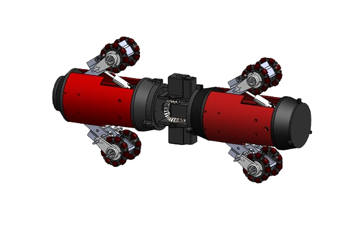
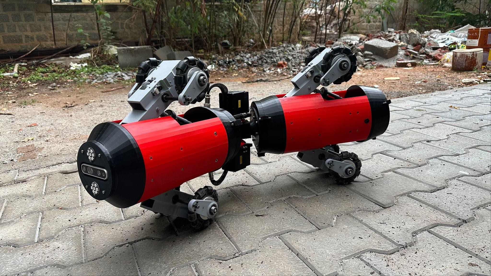
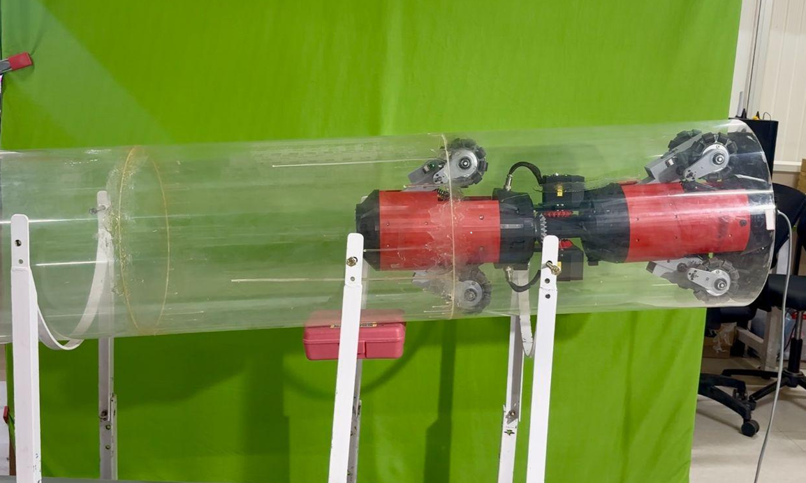
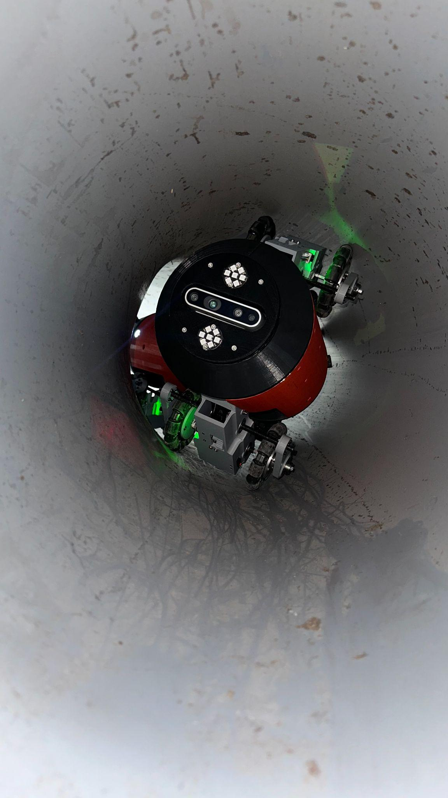

### Modular Center-Articulated Multi-modal Inspection Robot

This repository contains the report and simulation code for a modular, center-articulated inspection robot developed for navigating both pipelines and ground environments. The robot features a 2-DoF joint, a configurable wheel distance locomotion mechanism, and a wall-press mechanism for stability in varying pipe diameters. MATLAB scripts for dynamic modeling and simulation using the Lagrangian approach are also included.

